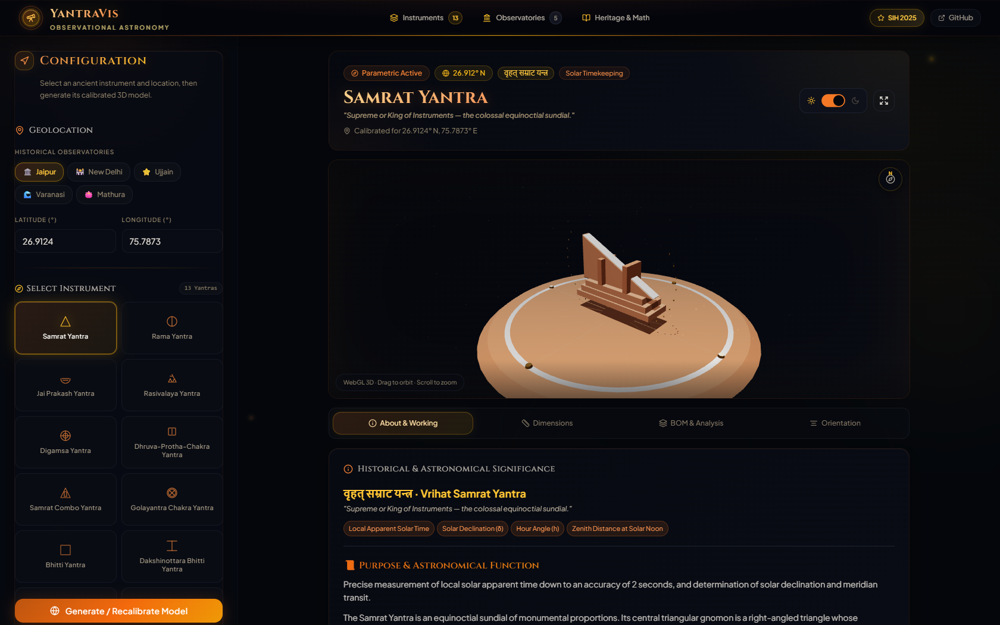
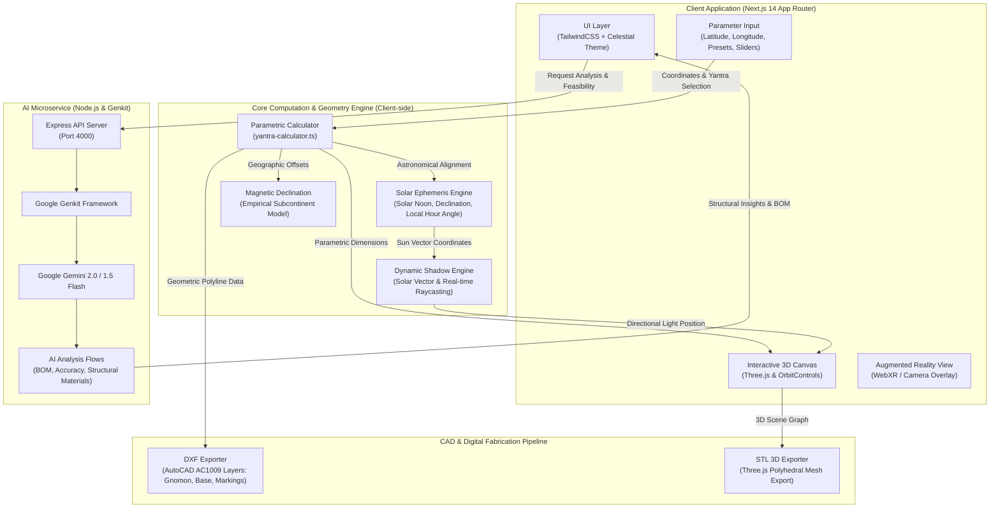
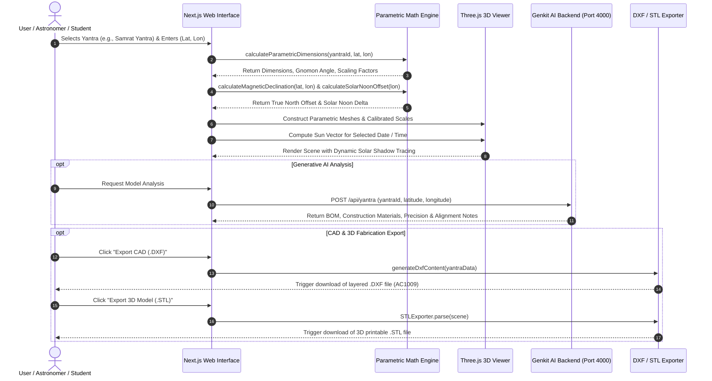
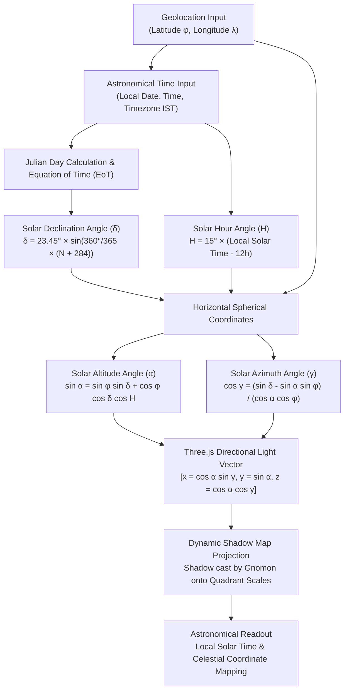
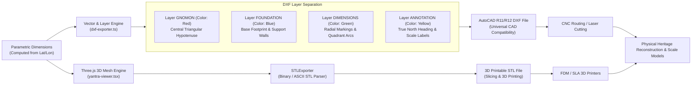
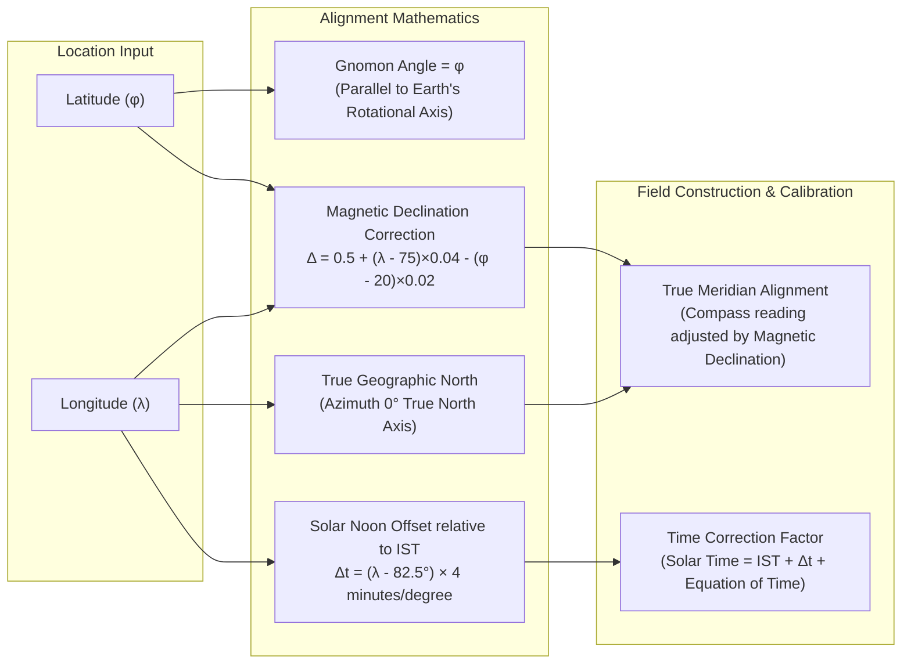

# YantraVis - Smart India Hackathon 2025

<p align="center">
  
  
  
  
  
  
  
</p>

### **SMART INDIA HACKATHON 2025**
- **Problem Statement ID**: 25156
- **Problem Statement Title**: Instruments in observational Astronomy
- **Theme**: Heritage & Culture
- **PS Category**: Software
- **Team ID**: 77386
- **Team Name**: Bitfusion-I

---

## 👨‍💻 Team & Contributors
- **Ayush Bhati** - Team Leader & Major Contributor

---

## 🖥️ Observatory Dashboard

<p align="center">
  
</p>

*Figure 1: YantraVis interactive dashboard featuring the 3D parametric Samrat Yantra, cardinal True North orientation markers, solar shadow simulation, real-time astronomical parameters, and digital fabrication exports.*

---

## 🎯 The Problem
Historically, there has been a lack of unified digital repositories for ancient astronomical instruments (*Yantras*), leading to the erosion of observational astronomy knowledge and educational gaps. Without modern computational tools, recalculating the geographic alignment, scale, and accuracy of these instruments for specific locations across India remains challenging—leaving ancient yantras preserved merely as static monuments rather than reproducible observational apparatus.

## 💡 Our Solution: YantraVis
**YantraVis** is a full-stack astronomical modeling and heritage preservation platform. For any latitude and longitude across India and worldwide, it calculates parametric construction dimensions for **13 historical instruments** (*Samrat, Rama, Jai-Prakash, Rasivalaya, Digamsa, Bhitti, Golayantra, etc.*), generates real-time 3D models with solar shadow simulation, provides precision CAD/STL exports for digital fabrication, and integrates generative AI for structural feasibility and material analysis.

- **Parametric Construction Dimensions**: Mathematically tailored dimensions derived from true geographic coordinates.
- **Interactive 3D Simulation**: Real-time WebGL rendering with solar position algorithms and dynamic shadow raycasting.
- **CAD & 3D Fabrication Export**: Native AutoCAD ASCII DXF layered export and STL 3D printing mesh generation.
- **Orientation & Calibration Guide**: Precise true north alignment, magnetic declination offset, and IST solar noon correction.
- **Dual Engine Architecture**: Instant client-side computation with optional Google Genkit AI backend for contextual insights and Bill of Materials.

---

## 🏛️ System Architecture

The following diagram illustrates the multi-tier architecture of YantraVis, detailing client interactions, mathematical engines, 3D WebGL rendering, CAD generation, and Genkit-powered AI microservices.



---

## 🔄 End-to-End Application Flow & User Journey

This sequence diagram depicts the end-to-end data lifecycle: from user parameter inputs to real-time 3D simulation, AI analysis generation, and fabrication file export.



---

## 📐 Supported Astronomical Instruments (13 Yantras)

YantraVis supports **13 ancient observational instruments**, classified across their primary astronomical measurement functions:

| Instrument | Sanskrit Name | Classification | Primary Astronomical Measurement |
| :--- | :--- | :--- | :--- |
| **Samrat Yantra** | सम्राट यन्त्र | Equinoctial Sundial | Local solar time (up to 2-second accuracy), hour angle, declination |
| **Rama Yantra** | राम यन्त्र | Cylindrical Alt-Azimuth | Celestial altitude and azimuth of stars, sun, and planets |
| **Jai Prakash Yantra** | जय प्रकाश यन्त्र | Hemispherical Bowl | Direct inverted sky mapping, coordinates, constellations, zodiac transits |
| **Rasivalaya Yantra** | राशिवलय यन्त्र | 12 Zodiac Dials | Direct celestial latitude and longitude as zodiac constellations transit meridian |
| **Digamsa Yantra** | दिगंश यन्त्र | Concentric Azimuth Rings | Precise azimuth angle of celestial bodies at rising, culmination, and setting |
| **Dhruva-Protha-Chakra** | ध्रुव-प्रोथ-चक्र | Polar Transit Ring | Alignment with Polaris (Dhruva Tara) and tracking circumpolar transits |
| **Samrat Combo Yantra** | संयुक्त सम्राट यन्त्र | Composite Observatory | Integrated equinoctial gnomon combined with sighting chakra rings |
| **Golayantra Chakra** | गोलयन्त्र चक्र | Armillary Sphere | Planetary pathways, ecliptic coordinates, and celestial spheres |
| **Bhitti Yantra** | भित्ति यन्त्र | Meridian Transit Wall | Solar meridian transit altitude, zenith distance, and local solar noon |
| **Dakshinottara Bhitti** | दक्षिणोत्तर भित्ति | Double Meridian Wall | Dual-faced meridian observation for solstitial and equinoctial declination |
| **Nadi Valaya Yantra** | नाडी वलय यन्त्र | Dual Equinoctial Dial | Northern and southern celestial hemisphere timekeeping across seasons |
| **Palaka Yantra** | फलक यन्त्र | Astronomical Plane Board | Portable sighting and trigonometric plane calculations |
| **Chaapa Yantra** | चाप यन्त्र | Meridian Declination Arc | Sighting celestial bodies along the local meridian arc |

---

## ☀️ Solar Ephemeris & Shadow Simulation Engine

The shadow simulation in YantraVis dynamically tracks the position of the sun based on spherical astronomy and real-time celestial mechanics:



---

## 🖨️ CAD & Digital Fabrication Pipeline

To transition from digital visualization to physical heritage reproduction or classroom scale models, YantraVis generates standard engineering files:



---

## 🧭 Geographic Alignment & Orientation Guide

Astronomical accuracy requires precise physical installation relative to the Earth's true geographic rotation axis:



---

## 🧮 Mathematical Foundations

| Instrument | Key Formulae & Geometry | Astronomical Utility |
| :--- | :--- | :--- |
| **Samrat Yantra** | $\text{Gnomon Slope Angle } \theta = \phi$ (Latitude)<br/>$\text{Height } H = W \times \tan\phi$<br/>$\text{Quadrant Radius } R = H / \sin\phi$ | Local Solar Time (accuracy up to 2 seconds), Hour Angle, Sun Declination |
| **Rama Yantra** | $\text{Cylinder Radius } R = 12 + \phi / 10$<br/>$\text{Pillar Height } = \text{Wall Height } H = 20 + \lambda / 15$<br/>Radial floor & wall slits = $1.5^\circ$ spacing | Direct readout of celestial Altitude ($\alpha$) and Azimuth ($\gamma$) |
| **Jai Prakash Yantra** | $\text{Bowl Diameter } D = 12 + \phi / 10$<br/>$\text{Depth } d = D / 2$<br/>Inverted celestial sphere with cross-wire shadow gnomon | Celestial coordinates, mapping sun in constellations, zodiac signs |
| **Rasivalaya Yantra** | 12 distinct dials; gnomon inclination aligned to ecliptic pole at moment each zodiac sign transits meridian | Direct reading of celestial latitude & celestial longitude |
| **Digamsa Yantra** | Concentric cylindrical walls with central pillar<br/>$\text{Outer Diameter } D_o = 14 + \phi / 10$<br/>$\text{Inner Diameter } D_i = 0.66 \times D_o$ | High-precision Azimuth measurement of rising/setting stars and planets |

---

## 🛠️ Tech Stack

- **Frontend**: Next.js 14 (App Router), React 18, TypeScript, TailwindCSS, Lucide Icons, Radix UI
- **3D & Visualization**: Three.js, OrbitControls, WebGL, STLExporter, Dynamic Directional Lighting & Realistic Shadow Mapping
- **Backend Service**: Node.js, Express, TypeScript, CORS, Dotenv
- **AI Integration**: Google Genkit, Google Gemini 2.0 / 1.5 Flash
- **CAD & Fabrication**: AutoCAD ASCII DXF (AC1009 universal spec), STL 3D Mesh exporter
- **Mathematical Engines**: Parametric Trigonometry, Solar Ephemeris Algorithms, Magnetic Declination approximations

---

## 📁 Repository Structure

```
YantraVis/
├── backend/                        # Node.js + Express + Genkit AI backend
│   ├── src/
│   │   ├── ai/
│   │   │   ├── flows/
│   │   │   │   ├── generate-yantra-analysis.ts    # AI BOM, accuracy & material flow
│   │   │   │   └── generate-yantra-description.ts # Historical context & descriptions
│   │   │   ├── genkit.ts                          # Google Genkit initialization
│   │   │   └── dev.ts
│   │   ├── lib/                                   # Pre-generated data & calculation helpers
│   │   └── server.ts                              # Express API entry point (:4000)
│   ├── package.json
│   └── tsconfig.json
├── src/                            # Next.js frontend application
│   ├── app/
│   │   ├── actions.ts              # Server action connecting client to backend/local engine
│   │   ├── layout.tsx              # Root layout & font configurations
│   │   ├── page.tsx                # Main YantraVis interactive dashboard
│   │   └── globals.css             # Design tokens & responsive styles
│   ├── components/
│   │   ├── app-header.tsx          # Navigation header with preset locations & directory
│   │   ├── ar-modal.tsx            # Camera AR preview modal
│   │   ├── full-screen-modal.tsx   # Expanded 3D viewport modal
│   │   ├── icons.tsx               # Custom SVG icons for all 13 Yantras
│   │   ├── yantra-details.tsx      # Parametric readout, AI analysis, CAD export
│   │   ├── yantra-form.tsx         # Coordinate picker & slider controls
│   │   └── yantra-viewer.tsx       # Three.js 3D canvas with shadow simulation
│   └── lib/
│       ├── dxf-exporter.ts         # AutoCAD DXF vector layer generator
│       ├── yantra-calculator.ts    # Core mathematical formulas & geometry engine
│       ├── yantra-knowledge.ts     # Curated historical details & architectural data
│       ├── yantras.ts              # Instrument metadata & registry
│       └── utils.ts
├── docs/
│   └── images/
│       └── dashboard.png           # High-resolution dashboard screenshot
├── package.json
└── README.md
```

---

## 🚀 Getting Started

### Prerequisites
- **Node.js** >= 18.x
- **npm** (or **pnpm** / **yarn**)
- **Google Gemini API Key** *(optional, for AI features; local mathematical engine runs with zero keys)*

### 1. Clone the Repository
```bash
git clone https://github.com/monkeysoul-cmd/YantraVis.git
cd YantraVis
```

### 2. Frontend Setup
```bash
npm install
npm run dev
```
The frontend will start at `http://localhost:3000`.

### 3. Backend Setup (Optional for AI Analysis)
In a separate terminal window:
```bash
cd backend
npm install

# Optionally configure your Gemini API key in backend/.env:
# GEMINI_API_KEY="your-gemini-api-key"
# PORT=4000

npm run dev
```
The backend API server will listen on `http://localhost:4000`.

> **Note**: If the backend is not running, YantraVis seamlessly falls back to its built-in client-side parametric calculator without interruption.

---

## 🌟 Benefits & Impacts

### 🎓 Educational
- Bridges ancient Vedic astronomical science with contemporary computational geometry.
- Interactive STEM learning reinforcement for schools, colleges, and planetariums.
- Visualizes solar movement, equinoxes, and solstices through real-time shadow simulation.

### 💰 Economic
- High ROI heritage tourism and interactive museum installations.
- Open-access CAD models enable low-cost local fabrication for educational institutions.
- Rapid prototyping removes the need for expensive physical trial-and-error construction.

### 🌍 Environmental & Heritage Preservation
- Preserves irreplaceable astronomical knowledge in open-standard digital formats.
- Protects fragile heritage structures (e.g. Jantar Mantar sites in Jaipur, Delhi, Ujjain, Varanasi) through virtual access.
- Eliminates material waste via parametric simulation before on-site civil works.

---

## 📊 Feasibility
1. **Technological Feasibility**: Built with modern, battle-tested open-source libraries (Next.js, Three.js, Genkit) ensuring cross-platform browser support without proprietary plugins.
2. **Financial Feasibility**: Free and open-source architecture with negligible hosting costs, enabling rapid public sector and educational adoption.
3. **Environmental Feasibility**: 100% digital calculation and virtual prototyping with zero material waste.
4. **Social & Cultural Feasibility**: Promotes national heritage awareness, STEM inclusivity, and cultural pride across diverse learning communities.

---

## 📜 License
This project was developed for the **Smart India Hackathon 2025** under Team **Bitfusion-I**. Distributed under the MIT License.
